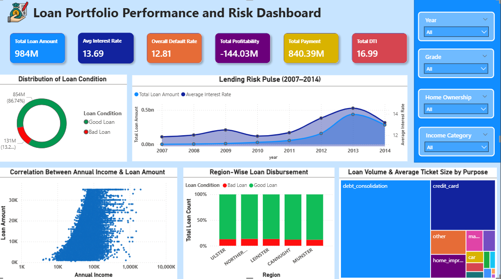
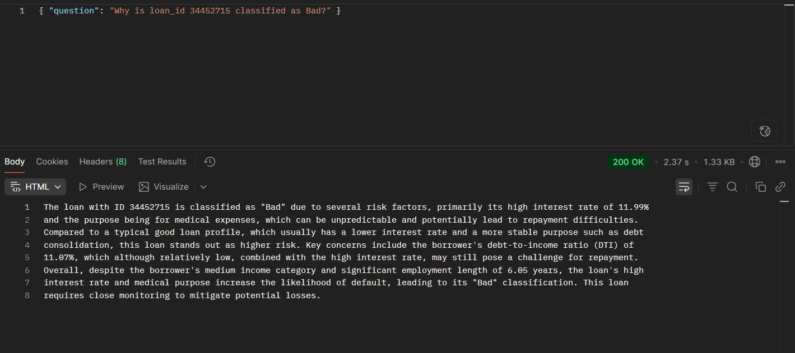

# Lending Risk & Performance Analysis — Consumer Loan Portfolio

An end-to-end data analytics project covering SQL-based ETL, exploratory data analysis in Excel, interactive Power BI dashboarding, and AI-powered automation workflows using n8n and a Large Language Model (Groq LLaMA). Built on a real-world consumer lending dataset (~70,000 loan records, 2007–2014).

---

## Problem Statement

Consumer lenders operate loan portfolios worth hundreds of millions without real-time visibility into risk concentration, regional default patterns, or borrower-level risk factors. Risk managers rely on manual reporting cycles — missing critical signals until it is too late to act.

This project answers three core business questions:

- Where is risk concentrated in this loan portfolio, and how severe is it?
- Which borrower profiles and regions are driving defaults?
- Can risk summaries and loan-level explanations be automated so risk teams don't depend on dashboards?

---

## What I Built

| Layer | Tool | Output |
|---|---|---|
| Data Engineering | PostgreSQL (SQL) | Cleaned dataset with engineered features |
| Exploratory Analysis | Excel | 20 analysis tasks, pivot tables, charts |
| Business Intelligence | Power BI | Interactive risk dashboard |
| Automation — Workflow 1 | n8n + Groq LLaMA | Weekly AI risk summary via email |
| Automation — Workflow 2 | n8n + Groq LLaMA | On-demand loan decision explanation via webhook |

---

## Key Findings

From the actual portfolio data:

- **12.81% bad loan rate** — over $131M of the $984M portfolio is at default risk
- **26.11% of loans fall in high-risk grades (D/E/F/G)** — more than 1 in 4 loans carries elevated risk
- **Portfolio is unprofitable** — total profitability stands at **−$144.03M**, meaning payments received do not cover loan amounts disbursed
- **Regional default disparity** — Leinster (13.19%) and N.IRL (13.45%) show consistently higher default rates vs. other regions, pointing to localized economic stress
- **Interest rate spread is a risk signal** — high-risk grade loans carry rates above 17%, while the portfolio average sits at 13.69%, indicating inadequate risk-based pricing at scale
- **Debt consolidation dominates loan purpose** — highest volume and ticket size, making it the single largest concentration risk by purpose

---

## Project Architecture

```
Consumer Loan Dataset (70K records, 2007–2014)
            │
            ▼
┌─────────────────────┐
│   SQL ETL Pipeline  │  PostgreSQL
│  Extract →          │  Null handling, feature engineering
│  Transform → Load   │  profitability, risk_flag, income_to_loan_ratio
└────────┬────────────┘
         │
         ▼
┌─────────────────────┐
│   Excel EDA         │  20 analysis tasks
│  Distributions      │  Pivot tables, scatter plots
│  Correlations       │  Conditional formatting
└────────┬────────────┘
         │
         ▼
┌─────────────────────┐
│     Power BI        │  Interactive dashboard
│    KPI tiles        │  Slicers: Year, Grade, Region, Income
│                     │  Trend lines, donut charts, treemap
└────────┬────────────┘
         │
         ▼
┌──────────────────────────────────────────────┐
│              n8n Automation Layer            │
│                                              │
│  Workflow 1: Scheduled Risk Summary          │
│  Cron → PostgreSQL → Code → Groq LLM → Gmail │
│                                              │
│  Workflow 2: On-Demand Loan Explanation      │
│  Postman → Sends question → PostgreSQL →     │
│         Groq LLM                             │         
│         → Code → Respond to Webhook          │
└──────────────────────────────────────────────┘
```

---

## Tech Stack

- **PostgreSQL** — ETL pipeline, data cleaning, feature engineering
- **Excel** — EDA, pivot analysis, conditional formatting
- **Power BI** — Interactive dashboard, DAX measures, slicers
- **n8n** — Workflow automation (self-hosted)
- **Groq API (LLaMA 3)** — AI-generated risk summaries and loan explanations
- **Gmail** — Automated email delivery of weekly risk reports

---

## Dashboard



**Dashboard highlights:**
- 6 KPI tiles: Total Loan Amount ($984M), Avg Interest Rate (13.69), Default Rate (12.81%), Total Profitability (−$144.03M), Total Payment ($840.39M), Avg DTI (16.99)
- Lending Risk Pulse: dual-axis trend chart (2007–2014) — loan volume vs. interest rate
- Region-Wise Loan Disbursement: stacked bar showing bad vs. good loan split per region
- Loan Volume by Purpose: treemap — debt consolidation is the dominant category
- Income vs. Loan Amount: scatter plot showing borrower risk concentration
- Slicers: Year, Grade, Home Ownership, Income Category

---

## n8n Automation Workflows

### Workflow 1 — Automated Weekly Risk Summary

**Flow:** `Schedule Trigger → PostgreSQL → Code → HTTP Request (Groq) → Gmail`

The workflow pulls aggregated portfolio metrics from PostgreSQL every week, sends them to Groq LLaMA with a risk analyst prompt, and emails the AI-generated summary directly to the risk team — no manual action required.


**Sample AI-generated email output:**


The AI identified:
- 12.81% bad loan rate as a concentration risk flag
- D/E/F/G grade exposure at 26.11% as a portfolio threat
- Leinster and N.IRL as regional outliers requiring tighter approval policies
- Actionable recommendations: risk-based pricing, credit underwriting tightening, portfolio stress testing

---

### Workflow 2 — On-Demand Loan Decision Explanation

**Flow:** `Webhook → Code → PostgreSQL → Code → HTTP Request (Groq) → Code → Respond to Webhook`

A risk manager or compliance officer sends a natural language question via POST request. The system fetches the relevant loan record from PostgreSQL, passes it to Groq LLaMA, and returns a plain-English explanation of why the loan is classified as risky — in under 3 seconds.



**Example query:**
```json
{ "question": "Why is loan_id 34452715 classified as Bad?" }
```

**AI response (200 OK, 2.37s):**
> Loan 34452715 is classified as Bad due to a high interest rate of 11.99% combined with a medical expense purpose — an unpredictable repayment category. Despite a medium income category and 6.05 years of employment, the DTI of 11.07% combined with the high rate poses a repayment challenge. Requires close monitoring.

This workflow enables compliance-friendly, explainable AI decisions — a direct answer to the "black box" problem in lending risk.

---

## Repository Structure

```
lending-risk-analysis/
│
├── README.md
├── assets/
│   ├── dashboard.png
│   ├── n8n_workflow.png
│   ├── triggered_mail.png
│   └── input_output.png
│
├── sql/
│   └── etl_pipeline.sql          # Full ETL: extract, clean, transform, load
│
├── excel/
│   └── eda_analysis.xlsx         # 20 EDA tasks with charts and pivot tables
│
├── powerbi/
│   └── dashboard.pbix            # Interactive Power BI report
│
└── automation/
    ├── risk_summary_workflow.json         # n8n Workflow 1 export
    └── loan_decision_workflow.json        # n8n Workflow 2 export
```

---

## How to Run the Automation Workflows

**Prerequisites:**
- n8n installed (self-hosted or cloud)
- PostgreSQL with `loans_cleaned` table loaded
- Groq API key (free tier works)
- Gmail OAuth configured in n8n

**Steps:**
1. Import `.json` workflow files into your n8n instance
2. Set credentials: PostgreSQL connection, Groq API key, Gmail OAuth
3. Workflow 1: Activate the schedule trigger — runs automatically weekly
4. Workflow 2: Copy the webhook URL → send a POST request with `{ "question": "..." }`

---

## Business Recommendations

Based on the analysis:

1. **Tighten approval for D/E/F/G grade loans** — 26% exposure in high-risk grades is not sustainable at scale
2. **Implement risk-based pricing** — current rate spread does not adequately compensate for grade-level risk
3. **Regional intervention in Leinster and N.IRL** — apply stricter DTI thresholds or loan caps in high-default regions
4. **Automate weekly risk monitoring** — the n8n workflow removes the dependency on manual dashboard reviews
5. **Medical and small business loans need closer underwriting scrutiny** — these purpose categories show disproportionate default correlation

---

## Dataset

Consumer lending dataset — 70,000 loan records spanning 2007–2014.

Fields include: loan amount, interest rate, grade, DTI, income category, employment length, home ownership, loan purpose, region, loan condition (Good/Bad), total payments, recoveries.

---

*Built as part of a structured FinTech data analytics program. All analysis, SQL queries, dashboard design, and automation workflows are original work.*
